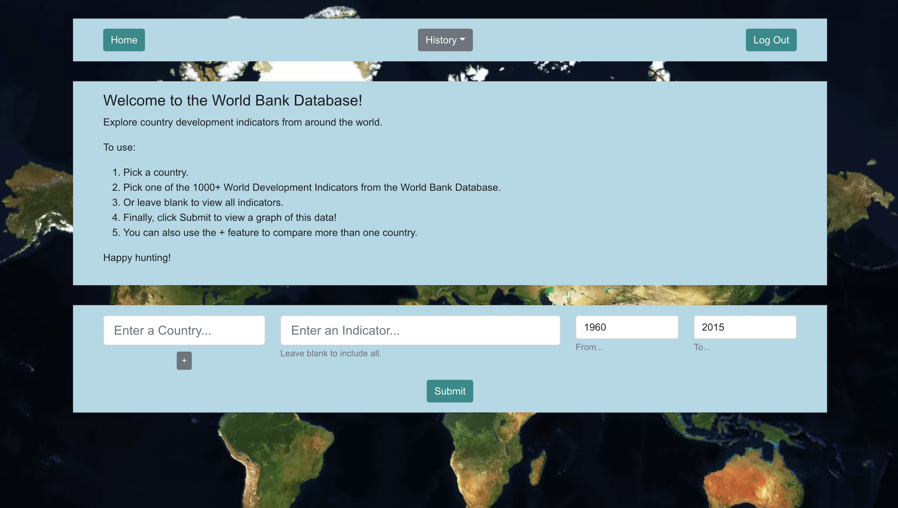
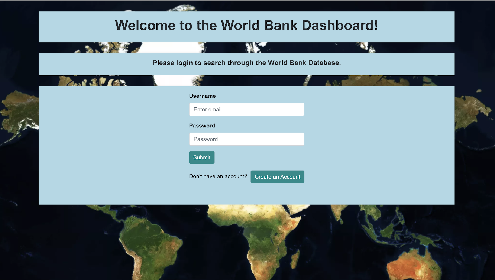

# World Bank Frontend


## Table of Contents

- [Introduction](#introduction)
- [Technologies](#technologies)
- [Setup](#setup)

## Introduction

This project uses analytics from the World Bank to create an App that will display all the data for a given country (or two) for a huge array of indicators. Using the '+' button will open the option to search for a second country. This will allow you to compare two countries for a given indicator, or all of them. In order to search for all indicators, leave the respective field blank. Specific years can also be searched for using the 'To' and 'From' toggles. Data used for this project can be obtained on Kaggle from this link: https://www.kaggle.com/kaggle/world-development-indicators 

Access to historic searches is only available once you have created an account and started making queries. In order to view previous searches, toggle the dropdown marked ```History``` on the Header when logged in. The dropdown items will contain all information about the search, including the first time it was searched for. Clicking any one of these past searches will show you the results of that search.



It contains a login and register system too, which allows users to create accounts in order to track previous searches, which can then be accessed from the Home page. Passwords are encrypted using the [bcrypt](https://deno.land/x/bcrypt@v0.3.0/mod.ts) package, and stored in a hosted database along with the salt used.



Using administrator credentials on the login page will give access to the admin area, which displays all searches made to the site.

## Technologies

This project has been created with:

- yarn version: 1.22.17
- bootstrap version: 5.1.3
- react version: 17.0.2
- react-bootstrap version: 2.1.2
- react-bootstrap-typeahead version: 6.0.0-alpha.8
- react-cookie version: 4.1.1
- react-dom version: 17.0.2
- react-router-dom version: 5.2.0
- recharts version: 2.1.9

## Setup

To run locally using yarn:

```
$ cd ../world-bank-app
$ yarn install
$ yarn start
```

As well as this. the related backend Server will also be required in order for the App to function properly. The backend repository for this project can be found [here](https://github.com/tomw13/WorldBankBackend). We recommend cloning both repositories to your local machine for ease of access.

## License

The license for this software can be accessed [here](LICENSE.md)
